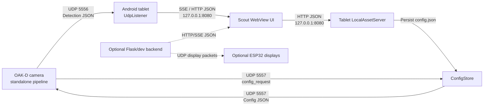

# Scout Ecosystem Technical Overview

This document explains how the Gridfront Scout products come together
technically: what each part owns, how data moves between them, and the JSON
shape to expect at each boundary. It is the engineering companion to the
forward-facing Scout `0.1.0` technical overview.

Scout is a mounted spatial detection ecosystem for heavy equipment such as
excavators, wheel loaders, dozers, dump trucks, graders, and similar mobile
plant. It uses OAK-D stereo cameras to detect people, estimate their
machine-relative position, classify the active zone, and present that live state
to the operator on an Android tablet. The product category aligns with
human-form recognition camera systems used in construction safety: multi-camera
coverage, configurable zones, operator alerts, and system health awareness.
Scout's architecture keeps perception and zone classification on the OAK-D,
while the tablet owns setup, display, and local orchestration.

## System Map



The production path is local and latest-state oriented:

1. The OAK-D runs the flashed standalone pipeline.
2. It sends live detection state to the tablet over UDP.
3. The Android app stores only the newest packet and fans it out to the local
   WebView UI.
4. The UI edits tablet-owned config.
5. The tablet pushes camera-facing config back to the OAK-D over UDP.

UDP messages are best-effort latest-state packets, not an event log. Operators
need to know what Scout sees now; lost packets are replaced by the next packet,
and stale links should clear rather than replay old detections.

## Multi-Camera Model

Scout is designed for one tablet to receive and display multiple OAK-D cameras.
The target architecture supports up to six cameras streaming to the same tablet.
The message contract does not change as cameras are added:

1. Each camera has a unique `camera_id`, device IP, and mount pose in tablet
   config.
2. Each camera sends the same detection packet shape to tablet UDP port `5556`.
3. Each packet includes its `camera_id`, so the tablet/UI can keep packets
   separate until display time.
4. The WebView merges the freshest packet per camera into one operator view.
5. The combined UI state uses the most urgent active `scene_state_code`; red
   on any camera makes the scene red.
6. Counts and nearest-distance readouts are aggregated across active camera
   packets, while each detection keeps its own `zone_code` and `camera_id`.

This lets Scout scale from one front camera to a multi-camera perimeter without
changing the basic packet contract.

## State Codes

Scout packets use numeric state codes for operational logic and strings for
human readability. The code is the decision value: higher numbers mean higher
urgency, so displays and alert logic can compare `3 > 2 > 1 > 0` without
parsing words. The string label stays beside the code so logs, demos, and
support conversations remain readable.

| Code | Scene meaning | Per-detection meaning |
| --- | --- | --- |
| `0` | No detections in the scene | Not used on a detection object |
| `1` | Detection exists, outside configured zones | This detection is outside configured zones |
| `2` | At least one detection is in the yellow zone | This detection is in the yellow zone |
| `3` | At least one detection is in the red zone | This detection is in the red zone |

The UI, displays, and alert logic should trust `scene_state_code` and
`zone_code`. The string fields `scene_state` and `zone` exist so logs and tools
are readable.

Code `0` belongs to the scene, not to an individual detection. No detections
means the array is empty. A detection object starts at code `1` because the
object exists, even when it is outside the configured zones.

## Ports And Channels

| Channel | Transport | Owner | Purpose |
| --- | --- | --- | --- |
| `5556/UDP` | OAK-D -> tablet | `script_runtime.py`, `UdpListener.kt` | Live detection packets |
| `5557/UDP` | OAK-D <-> tablet | `ConfigSync.kt`, `ConfigStore.kt`, `script_runtime.py` | Camera config request and tablet config push |
| `127.0.0.1:8080/TCP` | WebView <-> tablet app | `LocalAssetServer.kt` | Local app shell, HTTP API, and SSE stream |
| `127.0.0.1:5555/TCP` | Optional local proxy | `LocalAssetServer.kt`, Flask dev app | Debug/development fallback for API routes the tablet does not handle locally |
| Display UDP | Optional Flask/dev -> displays | `display_broadcaster.py` | Trimmed packets for ESP32 cab displays |

Android Wi-Fi ADB can also use TCP port `5555`, but that is a device
maintenance channel, not part of the Scout message contract.

## Detection Packet

**Direction:** OAK-D camera -> Android tablet  
**Transport:** UDP JSON on port `5556`  
**Primary code:** `pipeline/standalone/script_runtime.py`,
`android/app/src/main/java/io/gridfront/scout/UdpListener.kt`

The OAK-D sends one packet per publish tick. `target_fps` controls the network
publish rate. A value of `0` means uncapped network publishing.

Example red-zone packet:

```json
{
  "schema_version": 1,
  "type": "detections",
  "camera_id": "cam-0",
  "scene_state_code": 3,
  "scene_state": "red",
  "detections": [
    {
      "track_id": 12,
      "label": "person",
      "x_m": 0.72,
      "y_m": 5.18,
      "distance_m": 4.2,
      "zone_code": 3,
      "zone": "red",
      "zone_id": "red-inner"
    }
  ],
  "summary": {
    "detection_count": 1,
    "outside_count": 0,
    "yellow_count": 0,
    "red_count": 1,
    "highest_zone_code": 3,
    "closest_m": 4.2,
    "raw_count": 1
  },
  "units": "m",
  "link": "ok",
  "ts": 1778371200.123
}
```

Example no-detection packet:

```json
{
  "schema_version": 1,
  "type": "detections",
  "camera_id": "cam-0",
  "scene_state_code": 0,
  "scene_state": "none",
  "detections": [],
  "summary": {
    "detection_count": 0,
    "outside_count": 0,
    "yellow_count": 0,
    "red_count": 0,
    "highest_zone_code": 0,
    "closest_m": null,
    "raw_count": 0
  },
  "units": "m",
  "link": "ok",
  "ts": 1778371200.123
}
```

## Tablet Spatial API

**Direction:** Android tablet -> local WebView UI  
**Transport:** HTTP JSON and Server-Sent Events on `127.0.0.1:8080`  
**Primary code:** `LocalAssetServer.kt`, `UdpListener.kt`

### `GET /api/spatial`

Returns the latest OAK detection packet. If no packet has arrived, the tablet
returns an empty stale schema `1` payload:

```json
{
  "schema_version": 1,
  "type": "detections",
  "scene_state_code": 0,
  "scene_state": "none",
  "detections": [],
  "summary": {
    "detection_count": 0,
    "outside_count": 0,
    "yellow_count": 0,
    "red_count": 0,
    "highest_zone_code": 0,
    "closest_m": null
  },
  "units": "m",
  "link": "stale",
  "ts": null
}
```

### `GET /api/spatial/stream`

Opens an SSE stream. Each OAK packet is forwarded as a `data:` frame:

```text
data: {"schema_version":1,"type":"detections","camera_id":"cam-0","scene_state_code":0,"scene_state":"none","detections":[],"summary":{"detection_count":0,"outside_count":0,"yellow_count":0,"red_count":0,"highest_zone_code":0,"closest_m":null,"raw_count":0},"units":"m","link":"ok","ts":1778371200.123}

```

Keepalive comments are sent roughly every 15 seconds:

```text
: keepalive

```

## Camera Config Sync

**Direction:** OAK-D <-> Android tablet  
**Transport:** UDP JSON on port `5557`  
**Primary code:** `ConfigSync.kt`, `ConfigStore.kt`, `script_runtime.py`

The OAK-D asks for config on boot and then every 30 seconds. The tablet also
pushes config when camera-affecting settings change.

### Config Request

Sent by the OAK-D to the tablet:

```json
{
  "type": "config_request",
  "camera_id": "cam-0"
}
```

### Config Response / Push

Sent by the tablet to one OAK-D camera:

```json
{
  "type": "config",
  "camera_id": "cam-0",
  "pose": {
    "x_m": 0.0,
    "y_m": 4.0,
    "yaw_deg": 0.0
  },
  "zones": [
    {
      "id": "red-inner",
      "label": "red",
      "zone": "red",
      "color": "red",
      "display_color": "red",
      "severity_code": 3,
      "cx_m": 0.0,
      "cy_m": 0.0,
      "r_m": 3.5
    },
    {
      "id": "yellow-outer",
      "label": "yellow",
      "zone": "yellow",
      "color": "yellow",
      "display_color": "yellow",
      "severity_code": 2,
      "cx_m": 0.0,
      "cy_m": 0.0,
      "r_m": 6.0
    }
  ],
  "machine_footprint_m": {
    "length": 8.0,
    "width": 2.5
  },
  "target_fps": 10.0
}
```

Field notes:

| Field | Meaning |
| --- | --- |
| `pose.x_m`, `pose.y_m` | Camera location on the machine, in meters. |
| `pose.yaw_deg` | Camera yaw in degrees. Used to transform camera-frame detections into machine-frame detections. |
| `zones[].severity_code` | Operational zone severity. Larger is more urgent. Current values are `2` yellow and `3` red. |
| `zones[].label` / `zones[].zone` | Human-readable zone label. Current values are `yellow` and `red`. |
| `zones[].r_m` | Distance in meters from the machine footprint edge. |
| `zones[].cx_m`, `zones[].cy_m` | Present for wire compatibility. The current OAK runtime accepts them but classifies by `r_m` from the machine edge. |
| `machine_footprint_m.length` | Machine length in meters, along the machine Y axis. |
| `machine_footprint_m.width` | Machine width in meters, along the machine X axis. |
| `target_fps` | Desired detection publish rate from OAK to tablet. `0` means uncapped. |

## Tablet Config API

**Direction:** local WebView UI -> Android tablet  
**Transport:** HTTP JSON on `127.0.0.1:8080`  
**Primary code:** `LocalAssetServer.kt`, `ConfigStore.kt`

Important endpoints:

| Endpoint | Meaning |
| --- | --- |
| `GET /api/config` | Return the full tablet-owned config document. |
| `POST /api/config` | Replace full config and push to all installed cameras. |
| `GET /api/config/push` | Push current config to all installed cameras. |
| `POST /api/zones` | Replace zones and push to all installed cameras. |
| `POST /api/cameras` | Replace installed camera list and push to all cameras. |
| `POST /api/cameras/{camera_id}/pose` | Update one camera pose and push to that camera. |
| `POST /api/runtime` | Update runtime settings. `target_fps` changes push to all cameras. |
| `POST /api/models/active` | Mark a model as pending for the next flash cycle. |
| `POST /api/machine` | Update local machine metadata and footprint. Follow with `/api/config/push` if the footprint must reach cameras immediately. |

Example `POST /api/zones` request:

```json
{
  "zones": [
    {
      "id": "red-inner",
      "label": "red",
      "zone": "red",
      "color": "red",
      "display_color": "red",
      "severity_code": 3,
      "cx_m": 0.0,
      "cy_m": 0.0,
      "r_m": 3.5
    },
    {
      "id": "yellow-outer",
      "label": "yellow",
      "zone": "yellow",
      "color": "yellow",
      "display_color": "yellow",
      "severity_code": 2,
      "cx_m": 0.0,
      "cy_m": 0.0,
      "r_m": 6.0
    }
  ]
}
```

Response:

```json
{
  "ok": true,
  "zones": 2
}
```

## Health And Status

### `GET /api/camera/status`

Returns tablet-side camera/link status for the UI.

```json
{
  "state": "connected",
  "cameras": 1,
  "udp_age_ms": 142,
  "eth_up": true
}
```

`state` is categorical rather than severity ordered:

| State | Meaning |
| --- | --- |
| `connected` | At least one camera is configured and recent UDP data arrived. |
| `connecting` | A camera is configured, but no UDP data has arrived yet. |
| `error` | A camera is configured and data is stale or Ethernet is down. |
| `no_camera` | No cameras are installed in config. |

### `GET /api/system/health`

```json
{
  "status": "ok",
  "udp_age_ms": 142
}
```

When detection data is stale, `status` becomes `"stale"`.

## Optional Display Path

**Direction:** Flask/dev backend -> ESP32 displays  
**Transport:** display registration over HTTP, live packets over UDP  
**Primary code:** `display_broadcaster.py`

Displays register themselves, then the broadcaster sends trimmed latest-state
packets at a fixed rate.

Registration:

```json
{
  "ip": "192.168.1.50",
  "port": 5556
}
```

Display packet:

```json
{
  "schema_version": 1,
  "scene_state_code": 3,
  "scene_state": "red",
  "detections": [
    {
      "track_id": 12,
      "label": "person",
      "x_m": 0.72,
      "z_m": 4.14,
      "distance_m": 4.2,
      "zone_code": 3,
      "zone": "red"
    }
  ],
  "summary": {
    "detection_count": 1,
    "outside_count": 0,
    "yellow_count": 0,
    "red_count": 1,
    "highest_zone_code": 3,
    "closest_m": 4.2
  },
  "units": "m",
  "link": "ok",
  "ts": 1778371200.123
}
```

## Coordinate Conventions

| Convention | Meaning |
| --- | --- |
| Machine origin | Center of the machine footprint. |
| Machine X | Left/right across the machine width. |
| Machine Y | Front/back along the machine length. |
| Units | Meters for positions, distances, dimensions, and zone radii. |
| Timestamps | Unix epoch seconds for `ts`; tablet status APIs also expose local `udp_age_ms`. |

## Implementation References

| Contract | Code |
| --- | --- |
| OAK standalone detection and config runtime | `pipeline/standalone/script_runtime.py` |
| Android UDP detection receiver | `android/app/src/main/java/io/gridfront/scout/UdpListener.kt` |
| Android UDP config sync | `android/app/src/main/java/io/gridfront/scout/ConfigSync.kt` |
| Tablet config storage and camera config serialization | `android/app/src/main/java/io/gridfront/scout/ConfigStore.kt` |
| Local WebView HTTP/SSE API | `android/app/src/main/java/io/gridfront/scout/LocalAssetServer.kt` |
| WebView HUD and alert rendering | `android/app/src/main/assets/www/index.html` |
| Optional ESP32 display broadcaster | `display_broadcaster.py` |
| Dev backend state normalization | `detection_state.py`, `pipeline/zone_classifier.py` |
